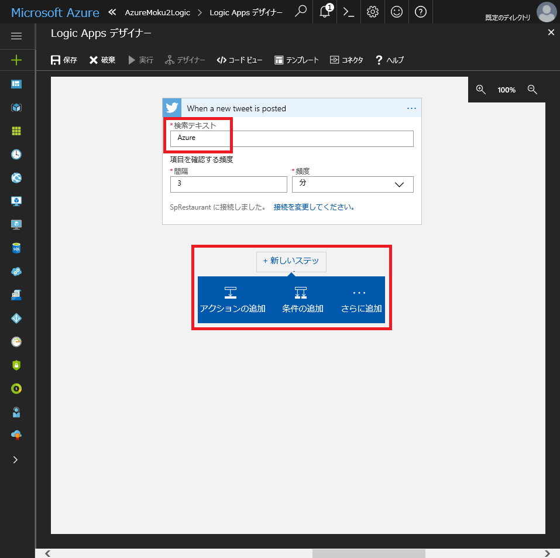

# Step 1 : ツイートを取得して、内容を保存する。
最初のステップでは、Azure Logic Apps に触れてみます。  
Twitter から任意の文字列を検索し、その内容を Azure Blob Storage に保存します。

## Logic Apps の作成
1. Azure ポータルに接続し、「+」ボタンをクリックして新規作成メニューを表示します。  
2. 「Web + モバイル」を選択して、「Logic App」をクリックします。

 
3. 「ロジックアプリの作成」画面で以下の内容を入力します。  

    **名前**  
    「AzureMoku2LogicApp」と入力します。

    **サブスクリプション**  
    利用するサブスクリプション名を選択します。    
    
    **リソースグループ**  
    「新規」を選択し、リソースグループを作成します。  
    「AzureMoku2Hnadson」と入力します。
    
    **場所**  
    「東日本」を選択します。
    
    **Log Analytics**  
    「Off」を選択します。

4. 「作成」ボタンをクリックします。  
    作成が完了して Logic Apps に接続すると、以下のような画面が表示されます。

## Storage の作成
1. Azure ポータルで「+」ボタンをクリックして新規作成メニューを表示します。  
2. 「Storage」を選択して、「Storage account」をクリックします。

3. 「Create storage account」画面で以下の内容を入力します。

    **Name**  
    任意の入力します。

    **Deployment model**  
    「Resource manager」を選択します。

    **Account kind**  
    「General purpose」を選択します。

    **Performance**  
    「Standard」を選択します。

    **Replication**  
    「LRS」を選択します。

    **Secure transfer required**  
    「Disabled」を選択します。

    **サブスクリプション**  
    利用するサブスクリプション名を選択します。

    **Resource group**  
    「既存のものを使用」をクリックし、先ほど作成した「AzureMoku2Handson」を選択します。

    **場所**  
    「東日本」を選択します。

4. 「作成」ボタンをクリックします。

5. 作成した Storage account を開き、「Blobs」をクリックします。

6. 「+ Container」をクリックします。
7. 「New container」ウィンドウで、以下の内容を入力します。  
    **Name**  
    「tweetcontainer」と入力します。

    **Public access level**  
    「Private (no anonymous access)」を選択します。
8. 「OK」ボタンをクリックします。

## Twitter を検索して、内容を保存する。
1. 前述で作成した Logic Apps を開きます。
2. 「Logic Apps デザイナー」画面で、「新しいツイートが投稿されたら」をクリックします。

3. Twitter の認証が必要となるため、「サインイン」をクリックします。

4. 利用する Twitter アカウント情報を入力し、「連携アプリを認証」ボタンをクリックします。

5. 「検索テキスト」に、Twitter 上で検索するキーワードを入力します。
6. 「新しいステップ」をクリックし、「アクションの追加」をクリックします。

7. アクションの一覧から「Azure Blob Storage」を選択します。

8. Azure Blob Storage のアクション一覧の中から「Azure Blob Storage : BLOB の作成」を選択します。

9. 「BLOB」の作成画面で以下の情報を入力します。  
    **接続名**  
    「AzureMoku2BlobStorage」と入力します。  
    Logic Apps のアクションは、利用するアクション毎にリソースグループに追加されます。  
    そこで識別するための名前を入力します。

    **ストレージアカウント**  
    「AzureMoku2」

10. 「作成」ボタンをクリックします。

11. 「BLOB の作成」画面で、以下の内容を入力します。

    **フォルダーのパス**  
    先ほど作成した「/tweetcontainer」を選択します。

    **BLOB 名**  
    「ツイート ID」を選択します。

    **BLOB コンテンツ**  
    「ツイートテキスト」を選択します。

12. 「保存」をクリックします。
13. 「×」をクリックして、ウィンドウを閉じます。

14. Logic Apps の概要ページで「トリガーの実行」をクリックします。
15. 「When_a_new_tweet_is_posted」をクリックします。

16. 「最新の情報に更新」をクリックし、「実行の履歴」に「成功」状態が追加されることを確認します。
17. 「無効」ボタンをクリックします。  
    ここで無効化しなかった場合は、手順「6」のキャプチャにあるように、3 分間隔でトリガーが実行されます。

18. Blob Storage を開き、手順「11」で指定したコンテナーにデータが保存されていることを確認します。

以上で Step 1 は完了です。  
