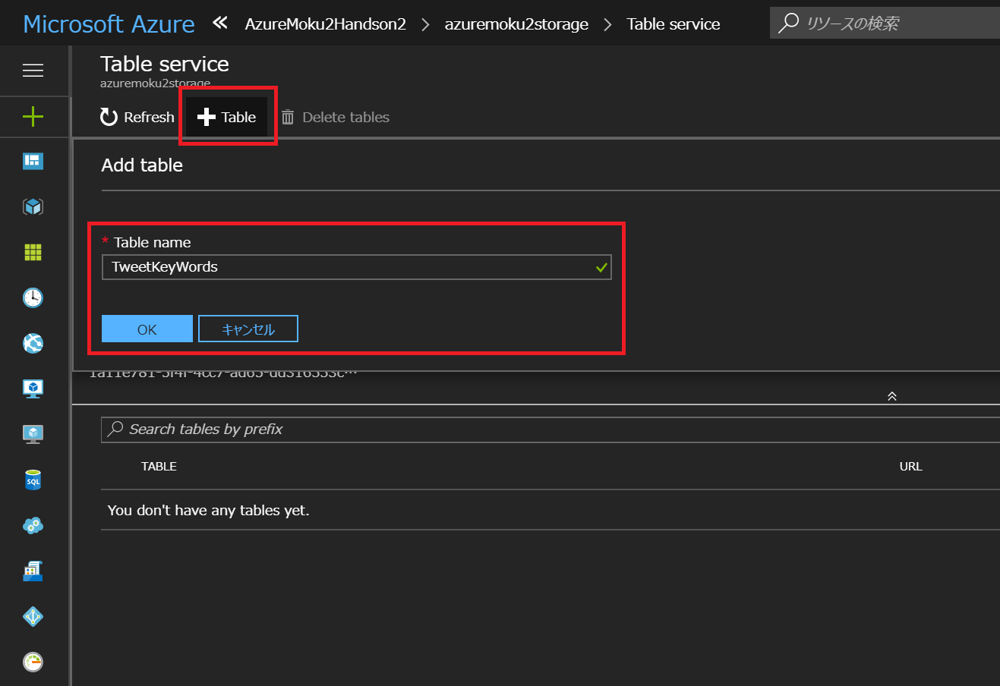
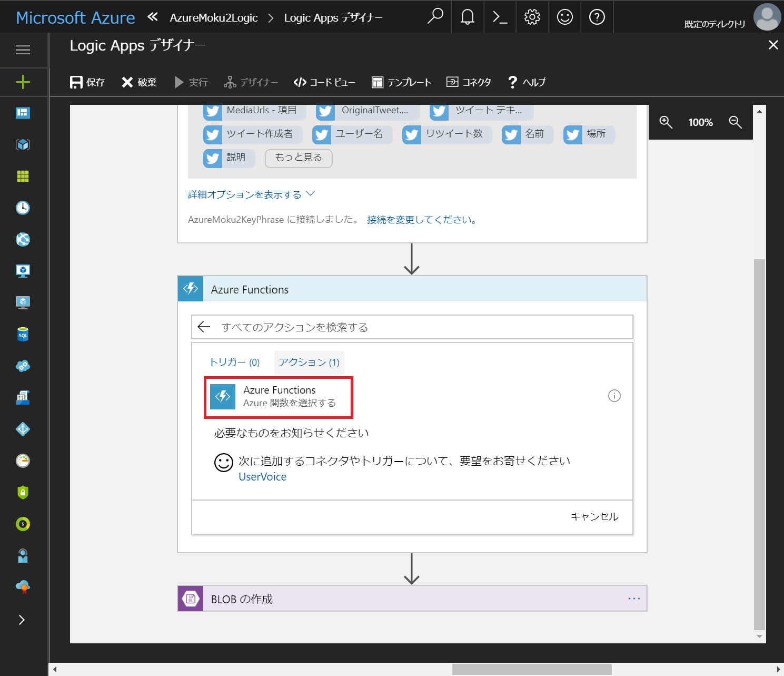
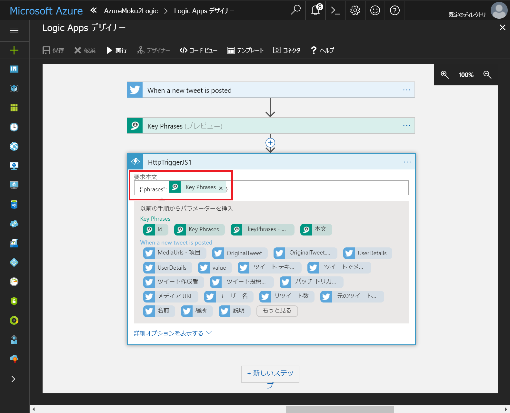

# Step 2 : ツイートからキーワードを抽出する。
このステップでは、Step 1 で作成した Logic Apps アプリを拡張します。

## Table Storage を作成する
1. Step 1 で作成したストレージアカウントを開きます。
2. 概要ページで「Tables」をクリックします。


3. 「Table service」画面で「+ Table」をクリックし、以下の内容を入力します。
    **Table name**  
    「TweetKeyWords」と入力します。

4. 「OK」ボタンをクリックします。



5. Storage account の画面に戻り、「Access keys」の「key1 : CONNECTION STRING」をコピーします。  
    コピーした文字列は、口述の Function App で使用します。


## Text Analytics を作成する
1. Azure ポータル画面で「+」をクリックします。
2. 検索ボックスで「Text」と入力し、検索候補として表示される「Text Analytics API」をクリックします。


3. 「Text Analytics API (preview)」の画面で「作成」ボタンをクリックします。


4. 「Create」画面で以下の内容を入力します。  

    **Name**  
    「AzureMoku2TextAnalytics」と入力します。

    **サブスクリプション**  
    任意のサブスクリプションを選択します。
    
    **場所**  
    「米国西部」を選択します。  
    
    **価格レベル**  
    「F0」を選択します。
    
    **Resource group**  
    「AzureMoku2Handson」を選択します。
    
    **I confirm I have read and understood the notice below.**
    チェックボックスにチェックを入れます。  

5. 「作成」ボタンをクリックします。


6. 作成した Text Analytics を開きます。
7. 「Key」画面で「KEY 1」をコピーします。  
    このデータは口述の Logic Apps から連携する際に使用します。


## Function App を作成する
1. Azure ポータル画面で「+」をクリックします。
2. 検索ボックスで「Function」と入力し、検索候補として表示される「Function App」をクリックします。


3. 「Function App」の画面で「作成」ボタンをクリックします。


4. 「Function App」の作成画面で、以下の内容を入力します。

    **アプリ名**  
    任意のアプリ名を入力します。
    
    **サブスクリプション**  
    任意のサブスクリプションを選択します。
    
    **リソースグループ**  
    「AzureMoku2Handson」を選択します。
    
    **ホスティングプラン**  
    「従量課金プラン」を選択します。
    
    **場所**  
    「東日本」を選択します。
    
    **Storage**  
    「既存のものを選択」をクリックし、「azuremoku2storage」を選択します。
    
    **Application Insights**  
    「オフ」を選択します。
    
5. 「作成」ボタンをクリックします。


6.  作成した Function App にアクセスし、関数セクションの「+」をクリックします。


7. 関数の作成画面で以下の内容を選択します。  

    **1. シナリオを選択します**  
    「webhook + API」を選択します。

    **2. 言語を選択します**  
    「JavaScript」を選択します。

8. 「この関数を作成する」ボタンをクリックします。


9. 「index.js」ファイルの中身を、以下の内容に置き換えます。
```
module.exports = function (context) {
    context.log('My function start.');

    context.bindings.tableBinding = [];
    
    var phrases = context.req.body.phrases;

    for (i = 0; i < phrases.length; i++) {
        context.bindings.tableBinding.push({
            PartitionKey: "MyPartition",
            RowKey: GenerateGuid(),
            KeyWord: phrases[i]
        });
    }

    context.done();
};

function GenerateGuid() {
    return Math.random().toString(36).substring(2, 15) +
        Math.random().toString(36).substring(2, 15);
}
```

10. 「保存」ボタンをクリックします。


11. 「ファイルの表示」をクリックします。
12. 「function.json」をクリックします。
13. 「bindings」に以下の定義を追加します。
```
    {
      "type": "table",
      "name": "tableBinding",
      "tableName": "TwitterKeyWords",
      "connection": "StorageConnectionString",
      "direction": "out"
    }
```

14. 「保存」ボタンをクリックします。


15. Functions のホームメニューをクリックします。
16. 「プラットフォーム機能」をクリックします。
17. 「Application settings」をクリックします。


18. 「アプリケーションの設定」に以下の内容を入力します。

    **名前**  
    「StorageConnectionString」と入力します。

    **値**  
    Storage account のキーを入力します。


19. 「Save」ボタンをクリックします。


## Logic Apps を拡張する
1. Step 1 で作成した Logic App を開きます。
2. 「概要」ページで「編集」ボタンをクリックします。


3. 下図のように、Twitter のトリガーアクションと「BLOB の作成」アクションの間をクリックし、「+」をクリックします。
4. 「アクションの追加」をクリックします。


5. アクションの一覧から「Text Analytics」をクリックします。


6. 「Text Analytics」のアクション一覧から「Key Phrases プレビュー」をクリックします。


7. 「Key Phrase」アクションに以下の内容を入力します。
    **接続名**  
    「AzureMoku2KeyPhrases」と入力します。  

    **Account Key**  
    前述でコピーした、Text Analytics のキーを貼り付けます。

8. 「作成」ボタンをクリックします。


9. 「Key Phrase」アクションに以下の内容を入力します。
    **Text**  
    「ツイートテキスト」を選択します。


10. 「+」をクリックします。
11. 「アクションの追加」をクリックします。


5. アクションの一覧から「Azure Functions」をクリックします。


6. 「Azure Functions」のアクション一覧から「Azure 関数を選択する」をクリックします。



7. 前述で作成した Function App を選択します。


8. 「要求本文」に以下の内容を入力します。  
    ```
    {"phrases": [Key Phrases]}
    ```



9. 「BLOB の作成」アクション右側の「…」をクリックします。
10. 「削除」をクリックします。


11. 「Logic Apps デザイナー」画面の「保存」ボタンをクリックします。


12. Logic Apps の概要ページに戻り、「トリガーの実行」をクリックします。  
    トリガーが「無効」になっている場合は、先に「有効」をクリックしてください。
13. 「最新の情報に更新」をクリックし、「実行の履歴」に履歴データが追加されることを確認します。  

ここまでの手順を完了すると、Azure Table Storage の中に、ツイッターから取得したキーワードが保存されます。

以上で、Step 2 の手順は終了です。
