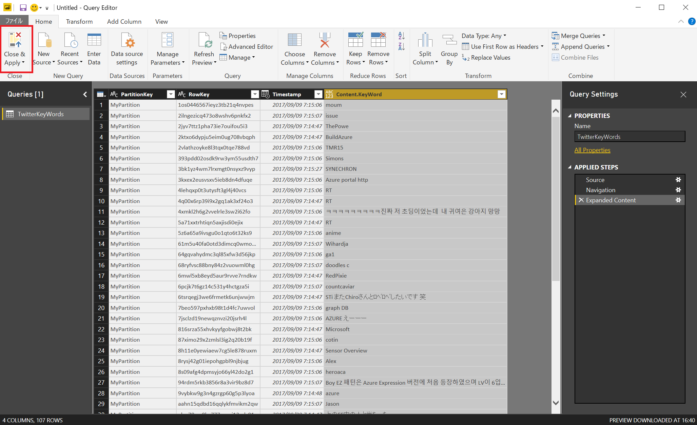

# Step 3 : 抽出したキーワードを可視化する。
このステップでは、Step 2 で抽出したツイートキーワードを Power BI で可視化します。

1. Power BI Desktop を起動します。
2. 「Get data」をクリックし、データソースを選択します。

3. 「Get data」ウィンドウで「Azure」カテゴリの「Azure Table Storage」を選択し、「Connect」をクリックします。

4. 「Account name or URL」欄に、Table storage の URL を貼り付け、「OK」ボタンをクリックします。

5. 「Navigator」ウィンドウでテーブルを選択し、「Load」ボタンをクリックします。

6. リボンの「Edit Queries」をクリックします。

7. 表示されているテーブルの「Content」列右端の展開アイコンをクリックします。

8. 選択されている項目はそのまま、「OK」ボタンをクリックします。

9. リボンの「Close & Apply」をクリックします。

10. 「Treemap」アイコンをクリックします。
11. 「Content.KeyWord」を「Values」に追加します。

以上の手順で、ツイートのキーワード傾向を閲覧することが可能です。  
この結果を Power BI (ブラウザ) でも閲覧したい場合は、以下の手順を実施してください。

12. リボンの「ファイル」をクリックします。
13. 「Publish」セクションの「Publish to Power BI」をクリックします。

